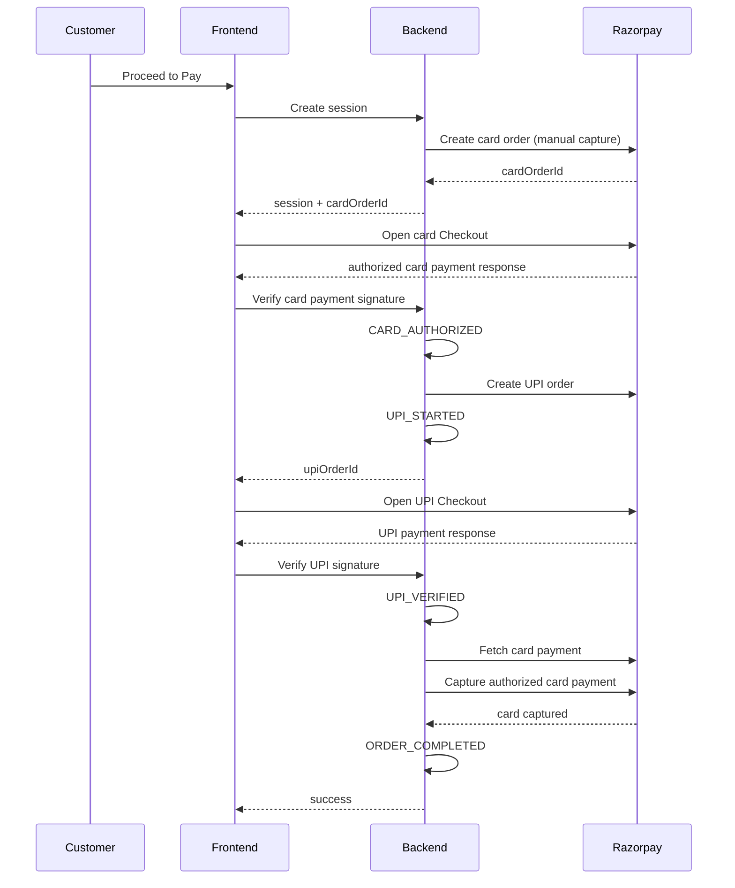
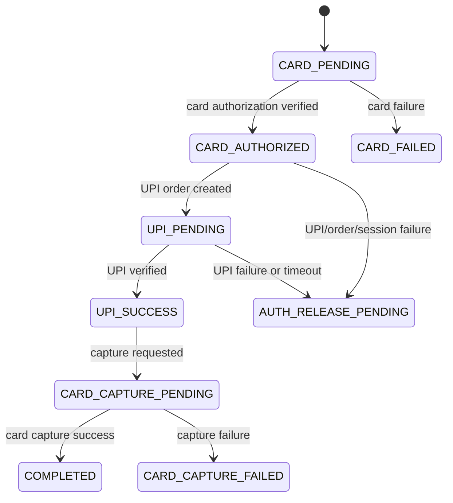

# Manual Capture Split Payment Flow

## Current Flow

The previous flow created a Razorpay card order with the account/default capture behavior. After Checkout returned a successful card payment response, the backend verified the signature, treated the card leg as successful, and created the UPI order. If the UPI leg failed later, the card payment could already be captured, so the system flagged or initiated a refund.

## New Authorization Flow

The card order is created with Razorpay manual capture settings. The card leg is authorized first, not captured. UPI is then collected. Only after UPI verification succeeds does the backend explicitly capture the authorized card payment. The order is completed only after card capture succeeds.

## Sequence Diagram



## State Diagram



## Webhook Sequence

Razorpay webhooks are treated as an async safety path:

- `payment.authorized` records `CARD_AUTHORIZED` for the card order when relevant.
- `payment.captured` for the UPI order records `UPI_VERIFIED` and attempts card capture.
- `payment.captured` for the card order records capture success but skips duplicate completion if the session is already complete.
- `payment.failed` for the UPI order leaves the card authorization uncaptured unless a legacy captured card is detected.
- `order.paid` for the UPI order attempts the same safe card-capture path.

All capture paths check whether the card has already been captured before calling Razorpay capture.

## Failure Handling

### Card Fails

The session moves to `CARD_FAILED`. No UPI order is created.

### UPI Fails or Times Out

The card is not captured. The session moves to `AUTH_RELEASE_PENDING`, and the authorization is left uncaptured. Razorpay releases/refunds uncaptured authorizations according to its capture-expiry behavior.

### UPI Succeeds but Card Capture Fails

The session moves to `CARD_CAPTURE_FAILED`. The exact Razorpay error is stored in `cardCaptureError`, and the session remains recoverable for an internal/admin-only retry path. No public card-capture retry endpoint is exposed.

### Duplicate Retries or Webhooks

The backend checks existing session state, `cardCapturedAt`, and `cardCaptureStatus` before capture. Duplicate events skip capture if the order is already complete or the card is already captured.

## Capture Timing

Card capture happens only after:

1. Card authorization is verified.
2. UPI payment is verified.
3. The card payment is fetched from Razorpay and confirmed to still be in `authorized` state.

Only then does the backend call:

```js
razorpay.payments.capture(paymentId, amount, 'INR')
```

## Rollback Notes

Rollback is a single-commit revert:

```bash
git revert <manual-capture-commit>
```

The revert restores the previous auto-capture behavior:

- card order creation without manual capture settings
- card verification treated as card success
- UPI failure path returning to refund/flag behavior
- timeout worker refunding captured card sessions
- webhook behavior based on captured card events

No database migration is required because the session store is schemaless JSON. Extra fields created by the manual-capture version are ignored once code is reverted.

## Future Improvements

- Add an admin UI action for retrying failed card capture.
- Display authorization-release status in the admin dashboard.
- Poll Razorpay for stale `AUTH_RELEASE_PENDING` sessions and reconcile final payment status.
- Add persistent idempotency keys or a durable transaction log if moving beyond the JSON session store.
- Add automated integration tests against Razorpay test-mode webhooks.
